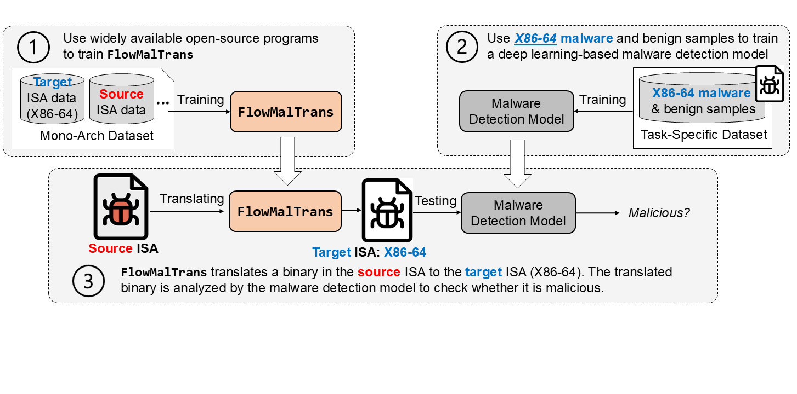

# FlowMalTrans [EMNLP 25]
FlowMalTrans: Unsupervised Binary Code Translation for Malware Detection

# Overview

Applying deep learning to malware detection has drawn great attention due to its notable performance. With the increasing prevalence of cyberattacks targeting IoT devices, there is a parallel rise in the development of malware across various Instruction Set Architectures (ISAs). It is thus important to extend malware detection capacity to multiple ISAs. However, training a deep learning-based malware detection model usually requires a large number of labeled malware samples. The process of collecting and labeling sufficient malware samples to build datasets for each ISA is labor-intensive and time-consuming. To reduce the burden of data collection, we propose to leverage the ideas of Neural Machine Translation (NMT) and Normalizing Flows (NFs) for malware detection. Specifically, when dealing with malware in a certain ISA, we translate it to an ISA with sufficient malware samples (like X86-64). This allows us to apply a model trained on one ISA to analyze malware from another ISA. Our approach reduces the data collection effort by enabling malware detection across multiple ISAs using a model trained on a single ISA.
<!-- Center the image -->

  

<!-- Add caption -->

  <em>Figure 1: FlowMalTrans architecture for cross-ISA binary translation</em>

